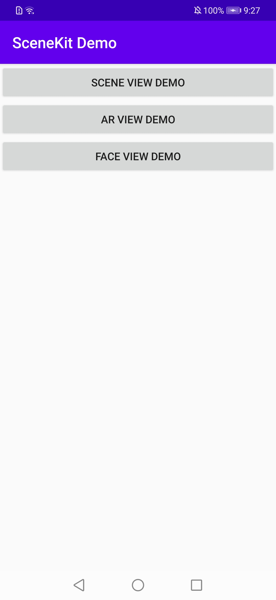
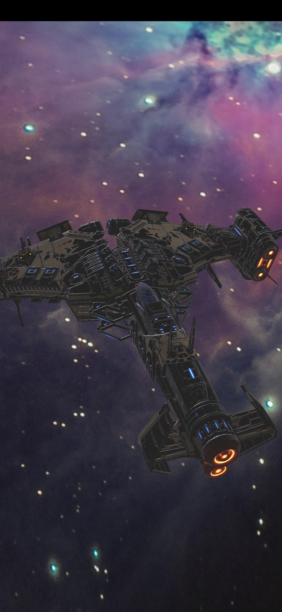
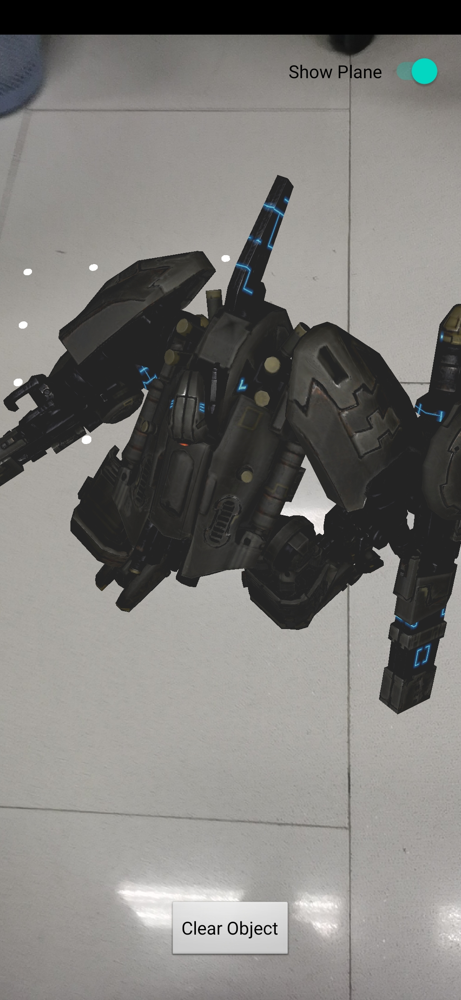
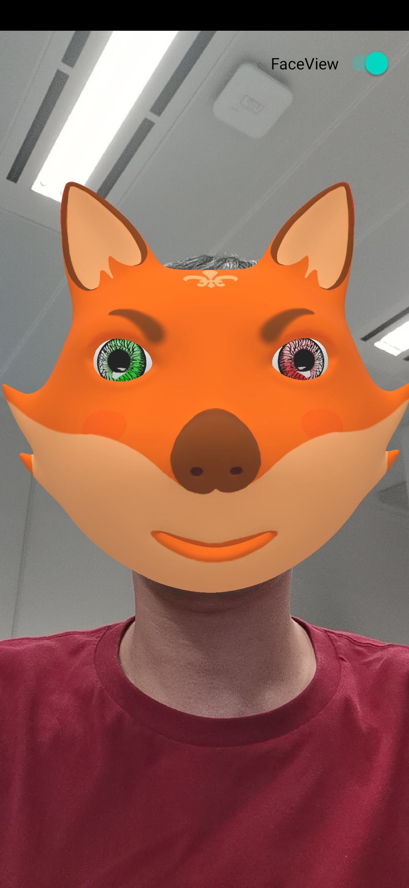

# 图形引擎服务示例代码
中文 | [English](https://github.com/HMS-Core/hms-scene-demo)
## 目录

* [简介](#简介)
* [开发准备](#开发准备)
* [开发环境](#开发环境)
* [运行结果](#运行结果)
* [许可证](#许可证)

## 简介

图形引擎服务示例代码演示了如何调用SceneView进行图形渲染。

[了解更多关于图形引擎服务](<https://developer.huawei.com/consumer/cn/hms/huawei-scenekit>)。

## 开发准备

   1. 检查Android Studio开发环境是否就绪。使用Android Studio打开示例代码工程路径下的build.gradle文件。同步后，在您已安装HMS Core APK的模拟器或华为手机上运行示例代码。
   2. 注册[华为账号](https://developer.huawei.com/consumer)。
   3. 创建应用并在AppGallery连接中配置应用信息。
   详情请查看: [华为图形引擎服务开发指南](<https://developer.huawei.com/consumer/cn/doc/development/HMSCore-Guides/dev-process-0000001050195424>)。
   4. 为了保证工程构建成功，请使用3.5版本以上的Android Studio。
   5. 在您的设备或模拟器上运行示例代码。

## 开发环境

* Android Stuido 3.5.0及以上版本
* JDK 1.7及以上版本
* HMS Core (APK) 4.0.2.300及以上版本
* Android 8.0及以上版本

## 运行结果

 

 

## 许可证

图形引擎服务示例代码采用的许可证为[Apache License, version 2.0](http://www.apache.org/licenses/LICENSE-2.0)。

3D模型素材'Mjolnir'，原作者为Star Conflict，采用的许可证为[Creative Commons Attribution license](https://creativecommons.org/licenses/by/4.0/legalcode)。

了解更多关于[Mjolnir](<https://sketchfab.com/3d-models/mjolnir-c8e9020d658649238ee3cfc1c1d64a68>)。
